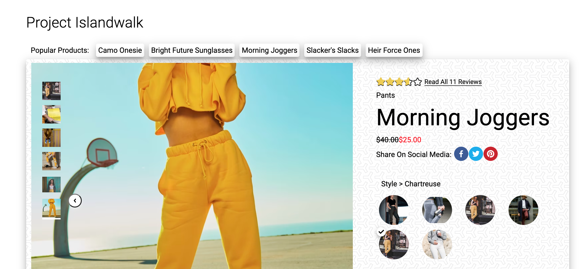
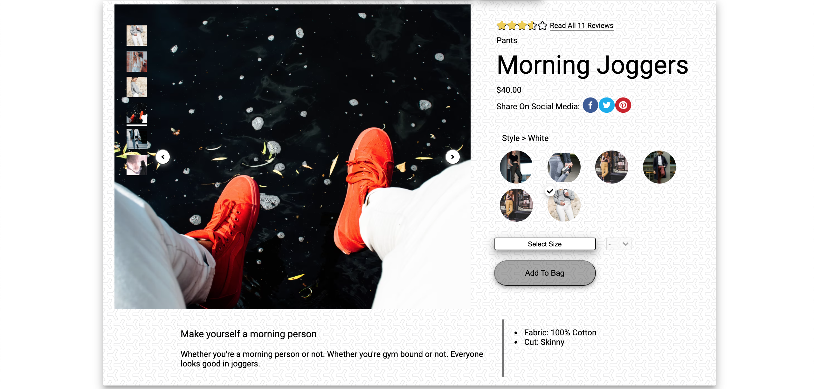
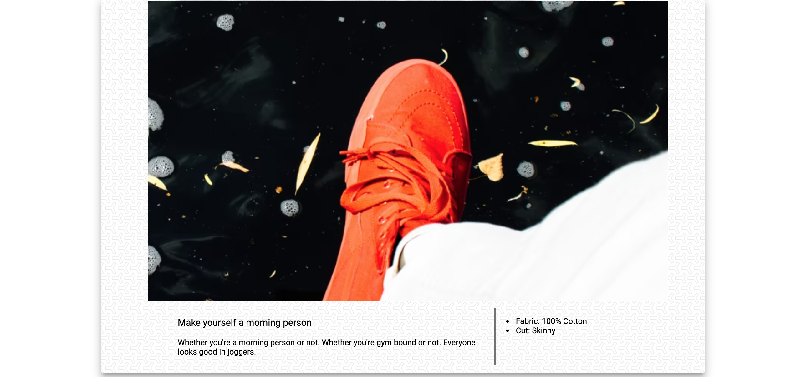
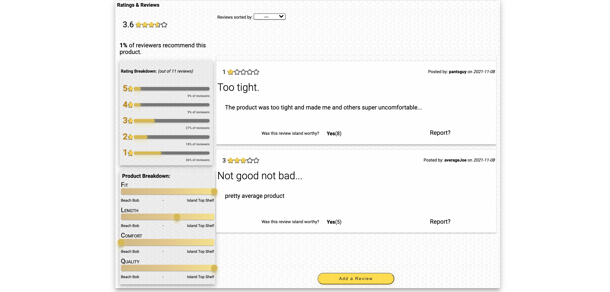
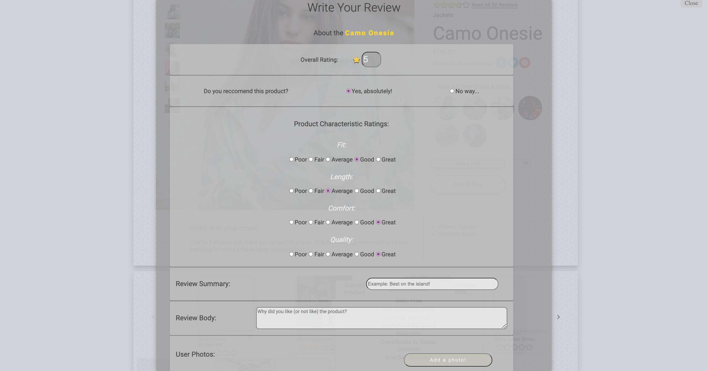

# Project Catwalk
## __by__ Da Island Bois

---

## Project Overview:

Welcome to the year 2021. We are living in a crazy time, where the **present** and the **future** are _synonymous_...

Companies are now being increasingly tasked with **upkeeping** their products to use modern _trends_, _styles_, and _characteristics_. This incredible amount of ever-evolving workload can create an incredibly challenging and **stressful** daily life for the engineers assigned to completing these tasks... That is where we come in.

_**Da Island Bois**_, established November 2021, jumped into this project with two missions:

* To **modernize** an out-of-date web application.
* To do this in a fashion that **destroys** the perception that working today has to be a stressful event. _Catch some waves as you go!_

---
---

## Table of contents:

* Description
* Installation
* Usage

---
---

# Description

## __Overview__ Component

**Product Overview**:

* Displays product details like name, price, and rating.

* Toggle between different styles/colors of each product.

* Select in-stock sizes and add to bag.

* Product description and specifications.

**Expanded View**:

* Click anywhere on image to toggle expanded view.

* Includes zoom feature that follows mouse around image.

* Click through carousel of images in exanded or default view.

---

## __Related Items and Outfit__ Component

**Related Products**:

* Displays a carousel of product tiles related to the current displayed product

* Clicking on a related product tile will cause a pop up to appear with details compared to the current product

**Outifit List**:

* Clicking "Add Outfit" button adds current product to a persistent list of products chosen by the user.

---

## __Ratings and Reviews__ Component

**Review Summary**:

* Average rating of product depicted by filled stars

**Recommendations**:

* The percentage of reviewers that reccomend the displayed product

**Rating Breakdown**:

* A rating number and bar filled with the percentage of total reviews given that rating.

**Product Breakdown**:

* Displays characteristics of shown product

* Visual representation of rating _(1-5)_

**Reviews**:

* Two reviews are displayed by default, selecting different sorting options in the drop-down list will re-render the page with a list of reviews sorted accordingly

* Each review tile displays the rating and review given by the reviewer, as well as the reviewers name and date the review was posted.

* Clicking **Yes** next to "Was this review island worthy _(helpful)_?" will update the number of users that found that review helpful.

* Clicking **Report** will not delete the review from database, but will hide it from future renders

* Clicking _Add a Review_ will open a modal window with input fields appropriate for the current product.

---
---

# Installation

1. Connect to island...

2. Open localhost:3000

