# Project Catwalk
## __by__ Da Island Bois

---
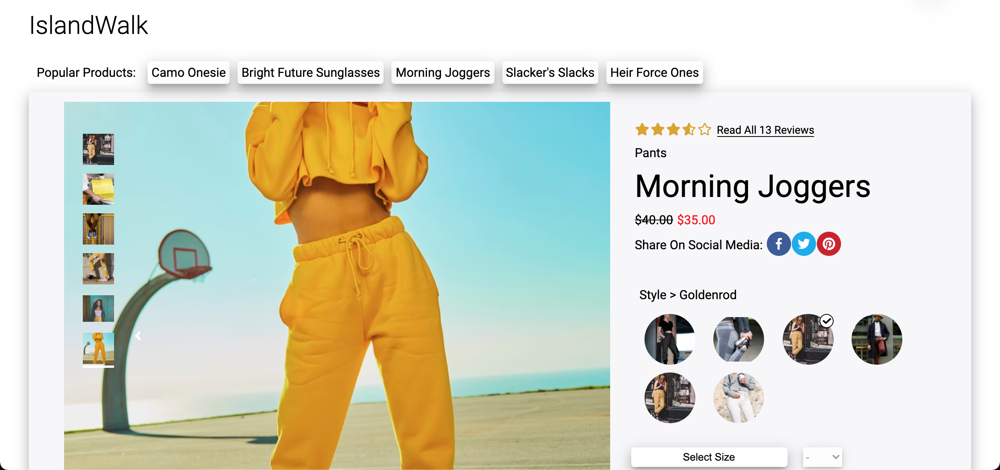

## Project Overview:

Welcome to the year 2021. We are living in a crazy time, where the **present** and the **future** are _synonymous_...

Companies are now being increasingly tasked with **upkeeping** their products to use modern _trends_, _styles_, and _characteristics_. This sizeable amount of constantly-evolving workload can create an incredibly challenging and **stressful** daily life for the engineers assigned to completing these tasks... _That is where we come in_.

_**Da Island Bois**_, established November 2021, jumped into this project with two missions:

* To **modernize** an out-of-date web application.
* To do this in a fashion that **destroys** the perception that working today has to be a stressful event. _Catch some waves as you go!_

---
---

## Table of contents:

* Description
  * Project Islandwalk
  * Overview Widget
  * Related Items & Outfit Widget
  * Ratings & Reviews Widget
* Installation
* Project Details
  * Team Members
  * Languages Used
  * Additional Info

---
---

# Description

## __Overview__ Widget

**Product Overview**:

* Displays product details like name, price, and rating.

* Toggle between different styles/colors of each product.

* Select in-stock sizes and add to bag.

* Product description and specifications.

**Expanded View**:

* Click anywhere on image to toggle expanded view.

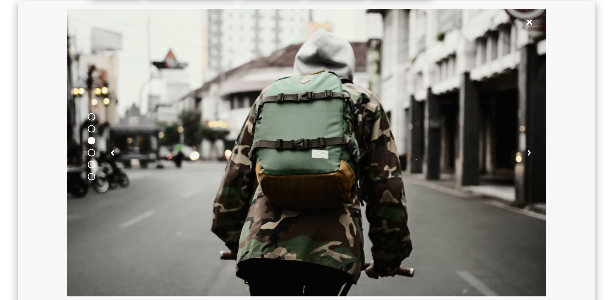

* Includes zoom feature that follows mouse around image.

* Click through carousel of images in exanded or default view.

---

## __Related Items and Outfit__ Widget

**Related Products**:

* Displays a carousel of product tiles related to the current displayed product

* Clicking on a related product tile will cause a pop up to appear with details compared to the current product

**Outifit List**:

* Clicking "Add Outfit" button adds current product to a persistent list of products chosen by the user.

---

## __Ratings and Reviews__ Widget

**Review Summary**:

* Average rating of product depicted by filled stars

**Recommendations**:

* The percentage of reviewers that reccomend the displayed product

**Rating Breakdown**:

* A rating number and bar filled with the percentage of total reviews given that rating.

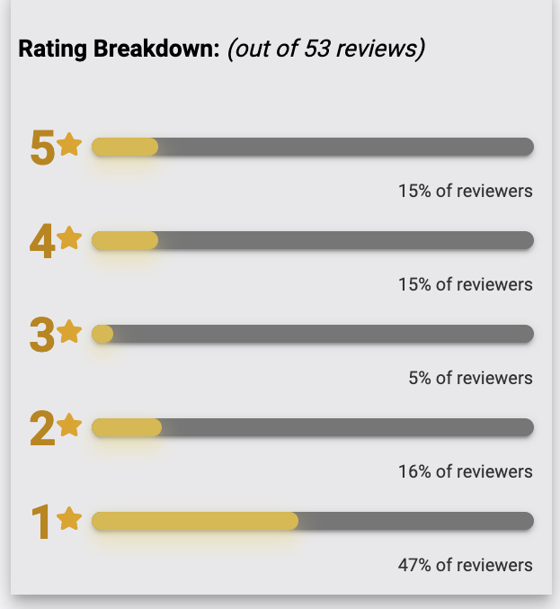

**Product Breakdown**:

* Displays characteristics of shown product

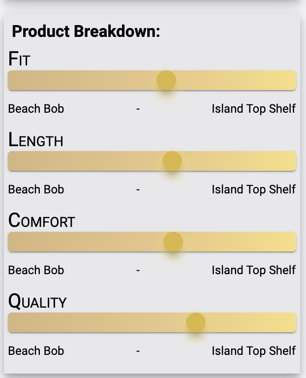

* Visual representation of rating _(1-5)_

**Reviews**:

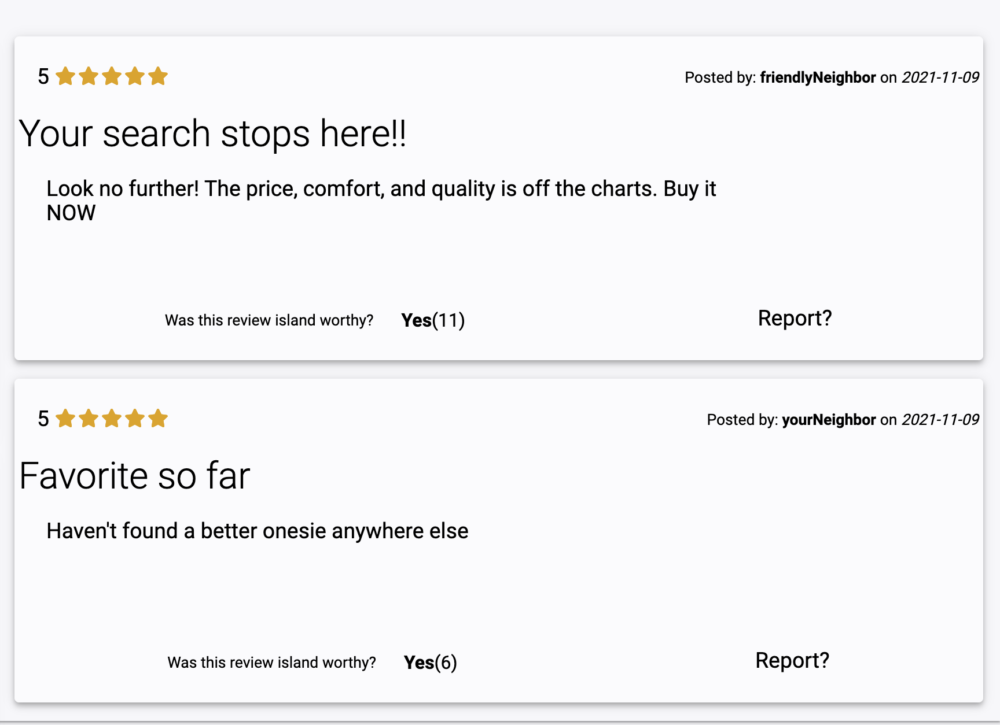

* Two reviews are displayed by default, selecting different sorting options in the drop-down list will re-render the page with a list of reviews sorted accordingly

* Each review tile displays the rating and review given by the reviewer, as well as the reviewers name and date the review was posted.

* Clicking **Yes** next to "Was this review island worthy _(helpful)_?" will update the number of users that found that review helpful.

* Clicking **Report** will not delete the review from database, but will hide it from future renders

* Clicking _Add a Review_ will open a modal window with input fields appropriate for the current product.

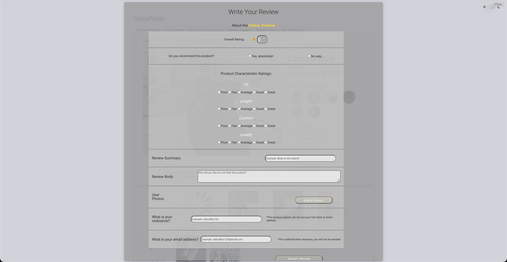

---
---

## [NEW] Light/Dark Theme Toggle

* Easliy toggle between light and dark backgrounds with a toggle button that always appears in the top-right of the screen.

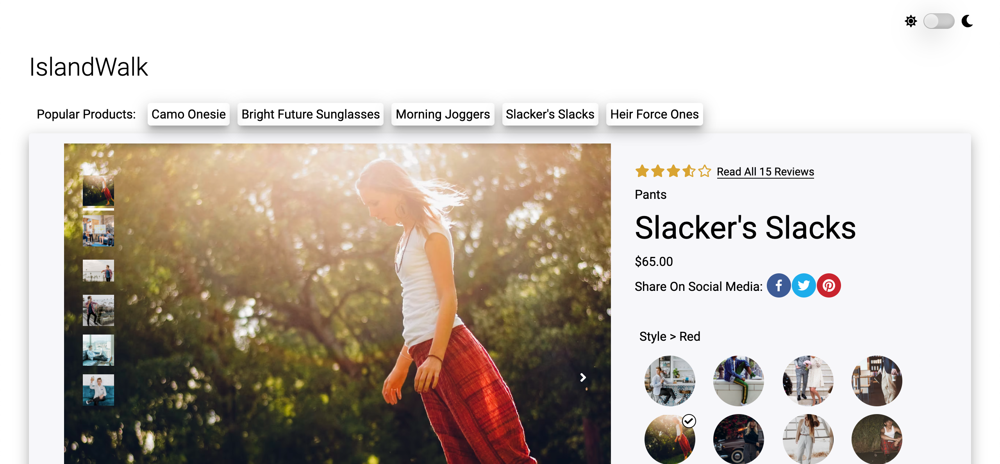
---
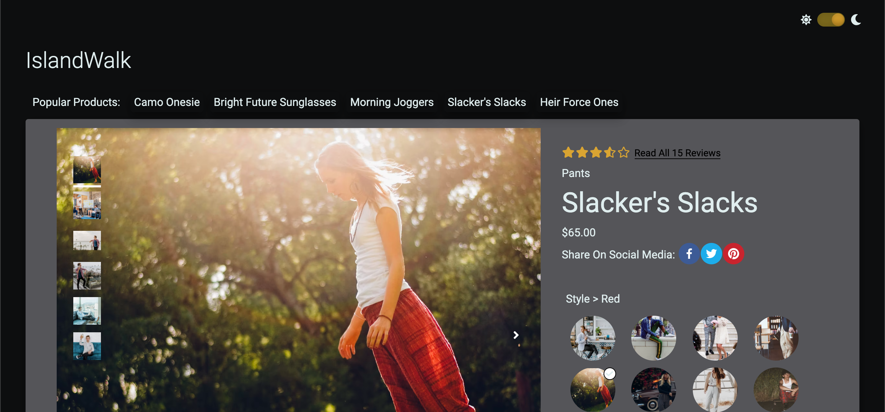

---
---

# Installation

## From Github,

1) **Fork** our repo in the top right corner of the screen:

2) Clone new fork to you local directory:

  * 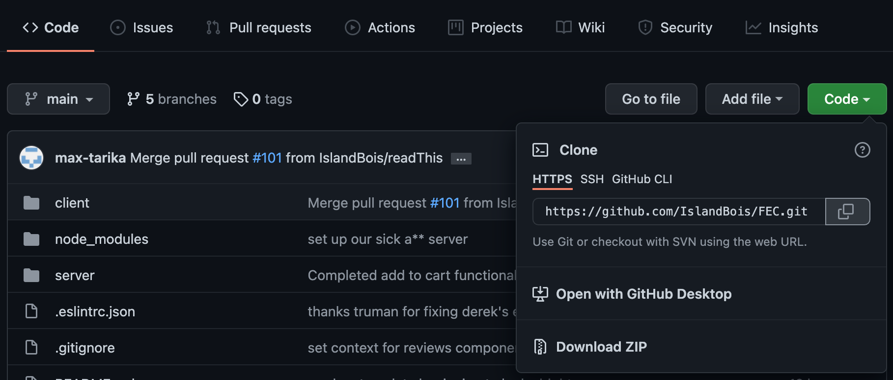

## From local directory,

1) Install dependencies by running `npm install`

  * 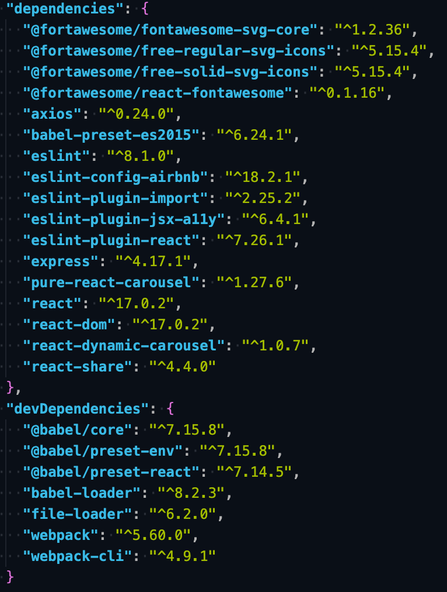

2) You'll need to use your own **access token** and create your own **config.js** file:

  * _See [here](https://docs.github.com/en/authentication/keeping-your-account-and-data-secure/creating-a-personal-access-token) to get started with a free github token_

  * _Next you'll just need to add the token and your campus code to config.js_

  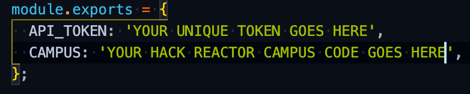

3) Almost ready! Now that you've installed dependencies and set up authorization you can start the server:

  * _Make sure you compile the .jsx files with webpack. Run_ `npm run pack` _in a terminal window..._

  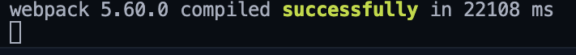

  * _In another terminal window, start the server by running_ `npm run server`

  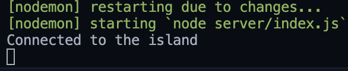

4) With webpack and the server running, open [**http://localhost:3000**](http://localhost:3000) in your favorite browser and enjoy!

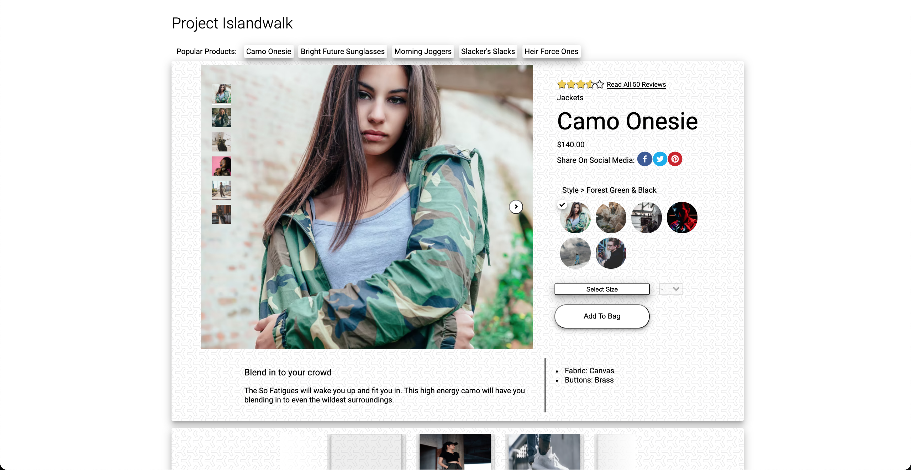

---
---

# Project Details

---

## Team **Da Island Bois** Members:

 > * **[Max Tarika](https://www.linkedin.com/in/max-tarika-025402137/)** _AKA_ Master of the **Overview** Components

 > * **[Jack Dowling](https://www.linkedin.com/in/jack-dowling-121290a5/)** _AKA_ Creater of the **Related Items & Outfit** Components

 > * **[Derek Mason](https://www.linkedin.com/in/3derekmason/)** _AKA_ The guy behind the **Ratings & Reviews** Components

---

## Languages and Frameworks Used

* Vanilla [HTML](https://developer.mozilla.org/en-US/docs/Web/HTML), [CSS](https://www.w3.org/Style/CSS/Overview.en.html), and [JavaScript](https://developer.mozilla.org/en-US/docs/Web/JavaScript)

* [React](https://reactjs.org/)

  * _Including_ [React Hooks](https://reactjs.org/docs/hooks-intro.html) _and class-less components_

* [NodeJS](https://nodejs.org/en/)

* [ExpressJS](https://expressjs.com/)

* [Axios](https://axios-http.com/)

* [Babel](https://babeljs.io/)

---

## Additional Info

* Banana Theme also available upon request.

---
---

---
> Heyo fellas, just wanted to add a note saying that it has been a really a great time working with each of you, what a fun project! _-Derek_
---